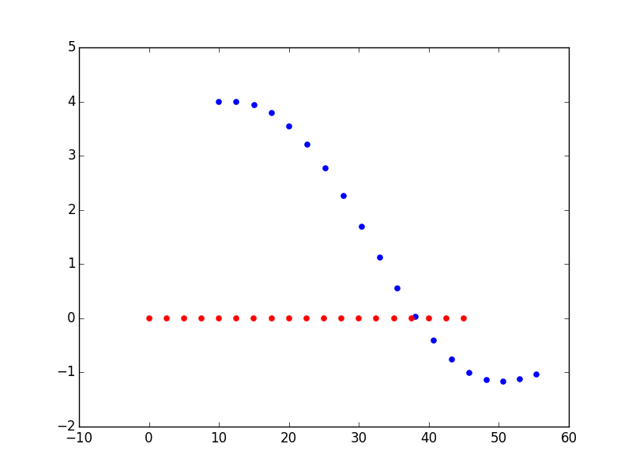

# polynomial_trajectory_generation
CarND-Term3: Trajectory Generation.

## Polynomial Trajectory Generation

Paper: [Optimal Trajectory Generation For Dynamic Street Scenarios In A Frenet Frame](http://video.udacity-data.com.s3.amazonaws.com/topher/2017/July/595fd482_werling-optimal-trajectory-generation-for-dynamic-street-scenarios-in-a-frenet-frame/werling-optimal-trajectory-generation-for-dynamic-street-scenarios-in-a-frenet-frame.pdf)

In this paper, some interesting (and potentially useful) topics were discussed like:

1. Cost Functions.
2. Differences between high speed and low speed trajectory generation.
3. Implementation of specific maneuvers relevant to highway driving like following, merging, and velocity keeping.
4. How to combining lateral and longitudinal trajectories.
5. A derivation of the transformation from Frenet coordinates to global coordinates (in the appendix).

## Polynomial Playground

1. From the code directory, run python evaluate_ptg.py. You should see a plot similar to the one below. This plot shows the s (x-axis) and d(y-axis) trajectories followed by a vehicle in traffic (red) and a self driving car (blue).

In this situation, the self driving car was trying to get behind the target vehicle, but the cost functions it was using weren't weighted appropriately and so it didn't behave as expected.

2. Fixing the Problem(s)

There are 5 files in the provided code directory. You'll probably want to start by modifying cost function weights in ptg.py but may also want to add cost functions of your own.

### File Descriptions

- ptg.py - The primary code for generating a polynomial trajectory for some constraints. This is also where weights are assigned to cost functions. Adjusting these weights (and possibly adding new cost functions), can have a big effect on vehicle behavior.
- cost_functions.py - This file contains many cost functions which are used in ptg.py when selecting the best trajectory. Some cost functions aren't yet implemented...
- evaluate_ptg.py - This file sets a start state, goal, and traffic conditions and runs the PTG code. Feel free to modify the goal, add traffic, etc... to test your vehicle's trajectory generation ability.
- constants.py - constants like speed limit, vehicle size, etc...
- helpers.py - helper functions used by other files.
